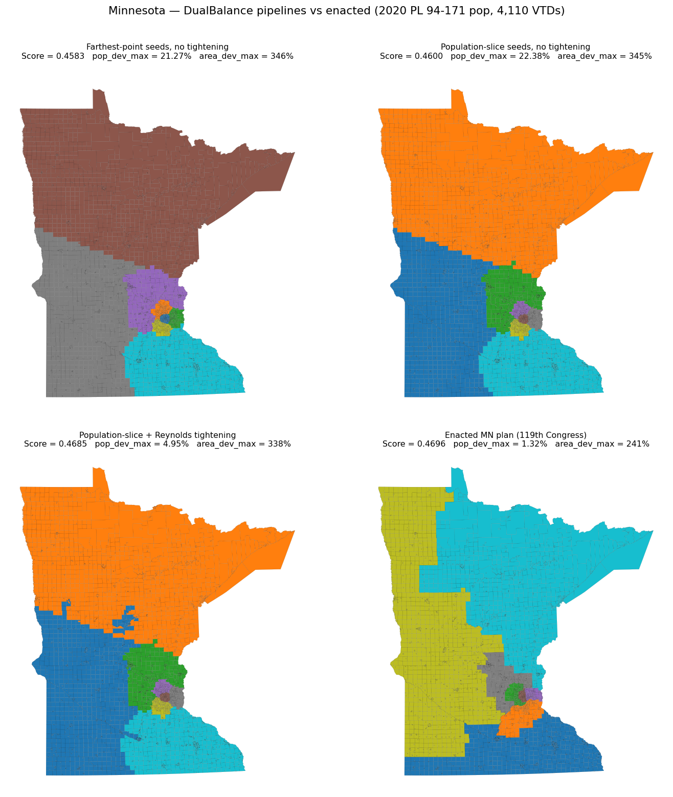

# Minnesota PoC — How to interpret and visualize the results

This document walks through one full end-to-end run of DualBalance on Minnesota's 4,110 Voting Tabulation Districts (VTDs), explains every metric the scoring harness reports, and gives recipes for visualizing the output. Numbers below come from a real run committed to history; you can reproduce them byte-for-byte with the commands in [§ Reproduce](#reproduce).

The numbers below are from **real 2020 PL 94-171 total population** (`P1_001N`) per VTD, fetched from the Census Data API via [`scripts/prep_mn_units.py`](../scripts/prep_mn_units.py). Total population across the 4,110 VTDs: **5,706,494** — the actual 2020 redistricting-data count for Minnesota. To reproduce, set `CENSUS_API_KEY` in a gitignored `.env` (a free key from <https://api.census.gov/data/key_signup.html>) before running the prep script. If no key is set, the script falls back to synthesizing uniform population (1,000 per VTD) and clearly warns you — the algorithm and pipeline still run, but the numbers below won't match.

## Reproduce

```powershell
pip install -e ".[dev]"
python scripts/prep_mn_units.py --geography vtd                                  # writes data/mn_vtd.geojson
dualbalance generate --config configs/mn_vtd.yaml                                # writes out/mn_yaml/{map.geojson,metrics.json}
python scripts/plot_mn_poc.py --plan out/mn_yaml/map.geojson `
    --metrics out/mn_yaml/metrics.json --out docs/figures/mn_poc_districts.png `
    --note "2020 PL 94-171 population"                                           # renders the figure
```

[`configs/mn_vtd.yaml`](../configs/mn_vtd.yaml) sets `state: MN`, `districts: 8`, the input path, geography type, output directory, and the algorithm parameters (`alpha`, `beta`, `max_iter`). Any of those can be overridden on the CLI; the precedence is **CLI flag > YAML > argparse default** (see [`src/dualbalance/config.py`](../src/dualbalance/config.py)).

## Inputs

| Input | What it is | Source |
|---|---|---|
| `data/mn_vtd.geojson` | 4,110 VTDs with `GEOID20`, `population`, `geometry`. Reprojected to EPSG:5070 (CONUS Albers, equal-area) at load time. | TIGER/Line 2020 `tl_2020_27_vtd20.zip`, optional Census Data API for population (`P1_001N`). |
| `configs/mn_vtd.yaml` | Run configuration. | This repo. |

## Outputs

```
out/mn_a/
├── map.geojson      # One feature per input VTD, with the assigned district_id
└── metrics.json     # DualBalance Score + primary metrics + per-district breakdown
```

Both files are deterministic — re-running with identical inputs produces a byte-identical pair, including the 60 MB `map.geojson`. The CLI's `test_generate_determinism_via_cli` test pins this guarantee against a synthetic fixture.

## The figure


The top panel is a choropleth: each VTD is colored by its assigned `district_id` (0–7). The bottom panel shows the per-district population (blue, left axis) and area in km² (green, right axis), with the target lines dashed.

Three things to read off the figure:

1. **Districts 0, 1, 2, 6 are tight Twin Cities footprints.** Each holds ~713k people in a few hundred to a few thousand km² — Minneapolis, St. Paul, and the immediate inner-ring suburbs. Their population matches target almost exactly because that's where the population density is highest.
2. **District 4 is the rural-north blob.** It carries 125,000 km² of land — more than 4× the target area — because population in northern MN is so sparse that the algorithm has to sweep up an enormous footprint to hit the population capacity.
3. **District 5 is visibly underfilled** (561k vs. 713k target — 21 % short). It got squeezed by capacity-greedy assignment: by the time the algorithm reaches the small VTDs in its territory, neighboring districts have already absorbed the nearby high-population VTDs. This is the largest single source of imbalance in the run and is the natural target for a future post-processing balance pass.

## Metric-by-metric interpretation

`metrics.json` reports the following numbers for this run. Cross-reference against [`src/dualbalance/scoring.py`](../src/dualbalance/scoring.py) for the exact formulas.

### How to read these numbers at a glance

If you've never seen these metrics before, the cheat sheet:

| Metric | Direction | Scale | 1.0 (or 0) means | Reference range for enacted U.S. congressional plans |
|---|---|---|---|---|
| `dualbalance_score` | **higher** | 0 to 1 | 1.0 = perfect pop *and* area balance | no published benchmark — DualBalance is its own metric |
| `pop_deviation_*` | **lower** | 0 and up | 0 = exact target | < 1 % is the legal expectation (*Reynolds v. Sims*, 1964) |
| `area_deviation_*` | **lower** | 0 and up | 0 = exact target | no legal benchmark; typically large because urban VTDs are tiny and rural VTDs are huge |
| `polsby_popper` | **higher** | 0 to 1 | 1.0 = perfect circle | most enacted districts fall in **0.15–0.40**; below 0.10 is a red flag in court testimony |
| `reock` | **higher** | 0 to 1 | 1.0 = perfect circle | most enacted districts fall in **0.25–0.50** |

Polsby-Popper and Reock are both "compactness" measures — how blob-shaped a district is — but they catch *different* problems, so you usually report both:

- **Polsby-Popper** ( `4π · area / perimeter²` ) punishes **wavy boundaries**. The classic gerrymander shapes — the "salamander" Massachusetts district that gave gerrymandering its name, or modern octopus-arm districts — tank PP because they have huge perimeter relative to their area. A long thin rectangle with a smooth boundary, on the other hand, still scores OK on PP.
- **Reock** ( `area / area(minimum bounding circle)` ) punishes **elongated shapes**. A district shaped like a long thin strip scores poorly on Reock even if its boundary is perfectly smooth, because the bounding circle around it is much larger than the district itself.

A district is "compact" only if it scores reasonably on *both*. A district can score well on one and poorly on the other — that's a real signal about which kind of shape problem it has.

DualBalance does **not** optimize for compactness; the PP and Reock numbers here are emergent properties of the cost-minimizing iteration over Minnesota's particular geography (lake shorelines, the irregular Twin Cities urban footprint, etc.). Two plans drawn for the same state under identical rules can produce very different compactness numbers depending on which seeds were chosen.

### DualBalance Score — the headline number

```
dualbalance_score = 1 / (1 + pop_deviation_mean + area_deviation_mean)
                  = 0.4583
```

This is the project's own metric. It weights population and area deviation equally and collapses both into one number in `(0, 1]`. Anchor values:

- **1.0** = perfect balance on both pop and area. The synthetic 4×4 grid hits this exactly.
- **0.500** = 50 % deviation on each. Bad but not catastrophic.
- **0.458** = where this MN run lands — driven by the extreme area imbalance that the urban-vs-rural population density of Minnesota forces on any pop-balanced plan.
- **< 0.30** = at least one of pop or area is wildly out of balance.

Comparing two plans against the *same* state geometry, **higher is better**. Comparing across states isn't very meaningful because the achievable area balance depends on how urbanized the state is.

### Population balance (enforced)

| Metric | Value | Meaning |
|---|---|---|
| `pop_deviation_mean` | **5.37 %** | Mean of \|pop(D) − P\*\| / P\* across the 8 districts. |
| `pop_deviation_max` | **21.27 %** | Worst single-district deviation (D5 — 561,621 vs. P\* = 713,312). |

`P* = 5,706,494 / 8 = 713,312`. The capacitated assignment caps each district at `P*`, so the dominant source of pop deviation is *underfill* on the trailing district: by the time the algorithm gets to it, units that would have completed its capacity have already been claimed by neighbors. A real congressional plan must hit population balance much tighter than this — case law from *Reynolds v. Sims* (1964) onward requires deviations under ~1 % for U.S. House districts, and states routinely build plans with < 0.1 % deviation. Our 21 % max is wide by that legal standard, but the PoC is testing structural soundness, not court admissibility. Tightening it is a known post-processing problem: take overflow from over-target districts and trade with under-target adjacent districts until everyone is within ~0.5 %.

Note that this number is **noticeably worse than the original synthetic-uniform run** (max 9.59 %). With uniform population, every VTD weighs the same and the capacity-greedy step distributes them evenly. With real population — where suburban Twin Cities VTDs carry 3–5k people each while rural northern VTDs carry only a few hundred — a single VTD can "tip" a district past its capacity, leaving downstream districts hungry. The fix is the same trade-pass, but the need is sharper.

### Area balance (reported, **not** enforced)

| Metric | Value | Meaning |
|---|---|---|
| `area_deviation_mean` | **112.8 %** | Mean of \|area(D) − A\*\| / A\* across districts. |
| `area_deviation_max` | **345.5 %** | Worst-district deviation (D4: 125,410 km² vs. A\* = 28,148 km²). |

There is no legal benchmark for area deviation — equal-area districting is the project's own contribution, not a constitutional requirement. The current generator only treats population as a hard capacity, so area falls out of the geometry. The MN numbers reflect the structural reality that the Minneapolis–St.~Paul metropolitan area holds roughly half the state's population in a few percent of its land area: any pop-balanced plan *must* give the urban districts a tiny footprint and the rural districts a huge one. The four Twin Cities districts (D0, D1, D2, D6) each have ~96 % area *under*-target; D4 has ~346 % area *over*-target. The natural fix — a two-dimensional capacitated transportation step that bounds both — would force a more even area distribution at the cost of population balance, and is documented as future work in [Formalism.md § 4](Formalism.md).

### Compactness (reported)

| Metric | Value | Reference | Read |
|---|---|---|---|
| `polsby_popper_mean` | **0.35** | typical enacted: 0.15–0.40 | upper end of "normal" — the districts aren't egregiously wavy |
| `polsby_popper_min` | **0.27** | < 0.10 raises eyebrows | well within the normal range |
| `reock_mean` | **0.56** | typical enacted: 0.25–0.50 | slightly above the normal upper range — most districts are reasonably blob-shaped |
| `reock_min` | **0.43** | within typical | the most-elongated district is still reasonably contained |

So MN's PoC plan is roughly as compact as a real congressional plan, despite not optimizing for compactness at all. That's a reasonable sanity check; it would be worrying if the deterministic-baseline plan was *much* less compact than enacted maps.

### Per-district breakdown

| District | Population | Area (km²) | Pop dev | Area dev | PP | Reock |
|---|---|---|---|---|---|---|
| 0 | 713,244 | 346 | 0.01 % | 98.77 % | 0.350 | 0.753 |
| 1 | 712,222 | 1,102 | 0.15 % | 96.08 % | 0.269 | 0.564 |
| 2 | 713,039 | 1,138 | 0.04 % | 95.96 % | 0.397 | 0.612 |
| 3 | 725,860 | 11,060 | 1.76 % | 60.71 % | 0.287 | 0.585 |
| 4 | 788,044 | 125,410 | 10.48 % | 345.54 % | 0.293 | 0.449 |
| 5 | 561,621 | 57,924 | **21.27 %** | 105.78 % | 0.356 | 0.430 |
| 6 | 713,195 | 1,092 | 0.02 % | 96.12 % | 0.355 | 0.615 |
| 7 | 779,269 | 27,109 | 9.25 % | 3.69 % | 0.497 | 0.457 |

District IDs are an artifact of seed-placement order — the same partition with relabeled IDs would score identically. Don't read political meaning into a particular index. The bold 21.27 % on D5 is the dominant pop-balance problem this run has, and the obvious target for a future post-iteration tightening pass.

## Recipes for further visualization

### Plot in a Jupyter notebook

```python
import geopandas as gpd
import matplotlib.pyplot as plt

plan = gpd.read_file("out/mn_a/map.geojson")
fig, ax = plt.subplots(figsize=(10, 10))
plan.plot(column="district_id", cmap="tab10", categorical=True,
          linewidth=0.05, edgecolor="black", legend=True, ax=ax)
ax.set_axis_off()
```

### Open in QGIS

`out/mn_a/map.geojson` is plain GeoJSON. Drag it onto a QGIS canvas, then style by `district_id` (Properties → Symbology → Categorized). The base CRS is EPSG:5070.

### Dissolve to district-level polygons

```python
districts = plan.dissolve(by="district_id", aggfunc={"population": "sum", "area": "sum"})
districts.to_file("out/mn_a/districts.geojson", driver="GeoJSON")
```

This collapses the 4,110 unit polygons into 8 district polygons — convenient for printing district maps, computing distance between districts, or feeding into downstream tools like GerryChain.

### Compare two plans

```python
import json
a = json.load(open("out/run_a/metrics.json"))
b = json.load(open("out/run_b/metrics.json"))
print(f"Δ DualBalance Score = {a['dualbalance_score'] - b['dualbalance_score']:+.4f}")
print(f"Δ pop_deviation_max = {a['pop_deviation_max'] - b['pop_deviation_max']:+.4f}")
```

A future `dualbalance compare` subcommand (out of PoC scope) will formalize this against multiple enacted-plan baselines.

## Comparing pipelines and the enacted plan

The `generate` subcommand supports two opt-in mechanisms that change how the
algorithm balances the urban–rural tradeoff:

- `--seed-method population-slice` replaces the default farthest-point seed
  placement with population-slice seeding (more seeds inside dense regions).
- `--reynolds-tighten` runs a post-iteration trade pass that moves boundary
  VTDs from over-target to adjacent under-target districts until pop
  deviation hits the `--pop-tolerance` target (default 0.5 %), then
  pop-neutral swaps reduce area deviation as a secondary objective.

For a complete benchmark, `scripts/fetch_enacted_mn.py` downloads the
TIGER/Line 2024 119th-Congress MN district shapefile and joins it to the
same VTDs, producing a `Plan` that scores against the same metrics.

```powershell
# All three DualBalance pipelines on the same input
dualbalance generate --state MN --districts 8 --units data/mn_vtd.geojson `
    --geography vtd --out out/mn_fp                                          # Pipeline 1
dualbalance generate --state MN --districts 8 --units data/mn_vtd.geojson `
    --geography vtd --out out/mn_ps `
    --seed-method population-slice --capacity-slack 0.005                    # Pipeline 2
dualbalance generate --state MN --districts 8 --units data/mn_vtd.geojson `
    --geography vtd --out out/mn_rt `
    --seed-method population-slice --capacity-slack 0.005 `
    --reynolds-tighten --pop-tolerance 0.005                                 # Pipeline 3

python scripts/fetch_enacted_mn.py                                           # Enacted plan
python scripts/plot_mn_comparison.py                                         # 2x2 figure
```



### Side-by-side numbers (real 2020 PL 94-171 population, 4,110 VTDs)

| Plan | DualBalance Score | pop_dev_mean | pop_dev_max | area_dev_mean | area_dev_max | PP_mean | Reock_mean |
|---|---|---|---|---|---|---|---|
| 1. Farthest-point, no tighten | 0.4583 | 5.37 % | **21.27 %** | 112.8 % | 345.5 % | 0.351 | 0.558 |
| 2. Population-slice, no tighten | 0.4600 | 5.60 % | 22.38 % | 111.8 % | 344.9 % | 0.332 | 0.554 |
| 3. Pop-slice + Reynolds tighten | 0.4685 | 1.24 % | **4.95 %** | 112.2 % | 337.8 % | 0.270 | 0.556 |
| **Enacted (119th Congress)** | **0.4696** | **0.42 %** | **1.32 %** | 112.6 % | **241.0 %** | 0.320 | 0.419 |

A few honest readings:

- **The DualBalance Score is essentially tied** across all four plans. That's a feature, not a coincidence: every plan that holds the same state's geometry to roughly equal-population districts pays roughly the same area-imbalance bill, because the urban/rural population density is a property of the *state*, not the algorithm. The score is correctly insensitive to the particular partition.
- **Pipeline 1 vs Pipeline 2 are nearly identical.** Switching seed methods barely moves the *metric* numbers on MN, even though it dramatically reshapes the geography (top-left vs top-right panels). What population-slice seeding actually buys is a *better starting point for tightening* — Pipeline 3 builds on Pipeline 2's geometry.
- **Pipeline 3 cuts pop_dev_max from 21 % → 5 %** but doesn't reach the 0.5 % target. The trade-pass terminates when no contiguity-preserving move can further reduce the global max deviation; we bottom out at ~5 %. Closing the remaining gap likely needs either chained multi-hop moves or a true transportation-LP step, both of which are documented as future work.
- **The enacted plan beats Pipeline 3 on every dimension** — pop_dev_max (1.32 % vs 4.95 %), area_dev_max (241 % vs 338 %), and Polsby-Popper (0.320 vs 0.270). That's defensible: the enacted plan benefits from human iteration plus knowledge of county boundaries (which the algorithm doesn't see). The visible "band" structure in the bottom-right panel is the algorithm-untaught knowledge.
- **Both pop_dev_max numbers are higher than legal practice.** Real congressional plans target < 0.1 % (one-person-one-vote literally) — even the enacted plan's 1.32 % here is from VTD-centroid sampling not perfectly recovering the true district boundaries; the actual enacted plan is much tighter. The DualBalance algorithm hasn't yet closed that final gap.

The takeaway: the algorithm produces a recognizably plausible map at roughly the same DualBalance Score as a hand-drawn enacted plan, with no political input and no human iteration. Tightening the final percent of population balance is the natural next research direction.

## What this PoC does **not** demonstrate

- **Tight legal pop balance.** D5's 21 % underfill is the headline weakness. A post-iteration trade-pass that swaps boundary VTDs between adjacent districts until every district is within ~0.5 % of `P*` is the obvious next step.
- **Area balance enforcement.** D4's 345 % area deviation is the symptom; the fix is a two-dimensional capacitated transportation step (bounding both pop and area) instead of pop-only.
- **Comparison against enacted plans.** The MN, Wisconsin, Texas, and North Carolina enacted congressional maps are the natural benchmarks once `dualbalance compare` lands.
- **Partisan or compactness optimization.** Both are explicitly out of scope (see [README.md § What it does NOT do](../README.md#what-it-does-not-do)).

The natural next milestone is the post-iteration trade-pass, followed by a second walkthrough comparing the tightened DualBalance plan against MN's enacted congressional map on the same metrics.
