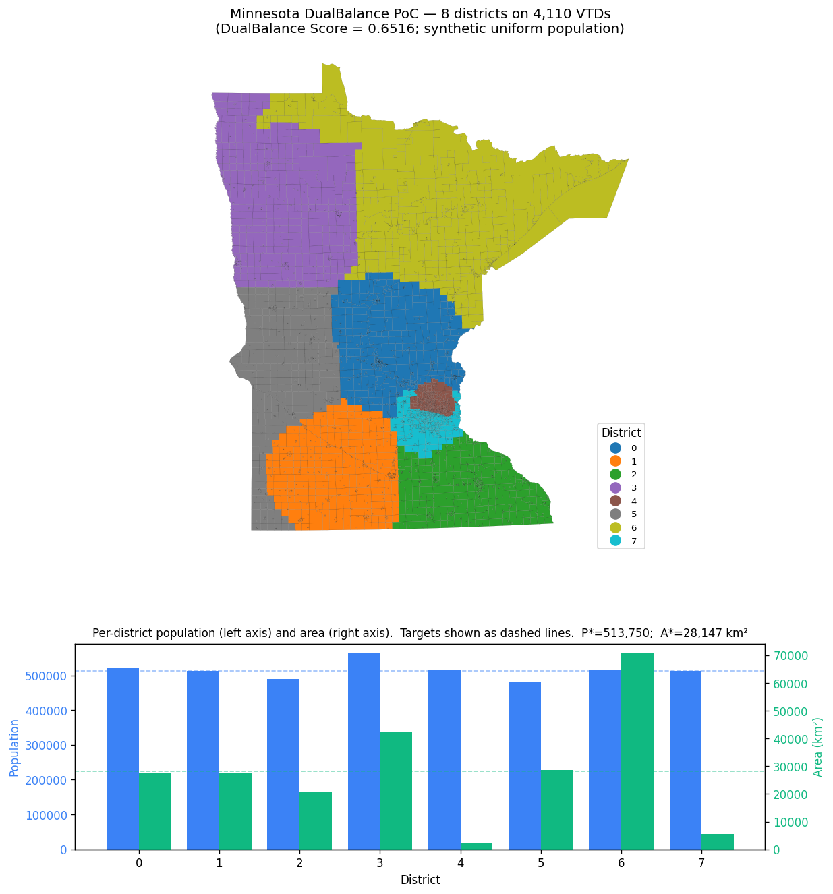

# Minnesota PoC — How to interpret and visualize the results

This document walks through one full end-to-end run of DualBalance on Minnesota's 4,110 Voting Tabulation Districts (VTDs), explains every metric the scoring harness reports, and gives recipes for visualizing the output. Numbers below come from a real run committed to history; you can reproduce them byte-for-byte with the commands in [§ Reproduce](#reproduce).

> **Important caveat up front.** This run uses **synthetic uniform population** (1,000 per VTD), because the prep script's Census Data API path was rejecting our key at the time the run was committed. The algorithm and pipeline are the same with real PL 94-171 population — only the per-district population numbers change. Re-run `scripts/prep_mn_units.py` once your `CENSUS_API_KEY` activates to refresh `data/mn_vtd.geojson` with real counts.

## Reproduce

```powershell
pip install -e ".[dev]"
python scripts/prep_mn_units.py --geography vtd                                  # writes data/mn_vtd.geojson
dualbalance generate --config configs/mn_vtd.yaml                                # writes out/mn_yaml/{map.geojson,metrics.json}
python scripts/plot_mn_poc.py --plan out/mn_yaml/map.geojson `
    --metrics out/mn_yaml/metrics.json --out docs/figures/mn_poc_districts.png   # renders the figure
```

[`configs/mn_vtd.yaml`](../configs/mn_vtd.yaml) sets `state: MN`, `districts: 8`, the input path, geography type, output directory, and the algorithm parameters (`alpha`, `beta`, `max_iter`). Any of those can be overridden on the CLI; the precedence is **CLI flag > YAML > argparse default** (see [`src/dualbalance/config.py`](../src/dualbalance/config.py)).

## Inputs

| Input | What it is | Source |
|---|---|---|
| `data/mn_vtd.geojson` | 4,110 VTDs with `GEOID20`, `population`, `geometry`. Reprojected to EPSG:5070 (CONUS Albers, equal-area) at load time. | TIGER/Line 2020 `tl_2020_27_vtd20.zip`, optional Census Data API for population (`P1_001N`). |
| `configs/mn_vtd.yaml` | Run configuration. | This repo. |

## Outputs

```
out/mn_a/
├── map.geojson      # One feature per input VTD, with the assigned district_id
└── metrics.json     # DualBalance Score + primary metrics + per-district breakdown
```

Both files are deterministic — re-running with identical inputs produces a byte-identical pair, including the 60 MB `map.geojson`. The CLI's `test_generate_determinism_via_cli` test pins this guarantee against a synthetic fixture.

## The figure



The top panel is a choropleth: each VTD is colored by its assigned `district_id` (0–7). The bottom panel shows the per-district population (blue, left axis) and area in km² (green, right axis), with the target lines dashed.

Two things to read off the figure:

1. **Districts 4 and 7 are small Twin Cities footprints.** They each contain ~510 VTDs of suburban density. Their populations match target almost exactly, but their land area is far below `A*` because each VTD is geographically tiny.
2. **District 6 is the rural-north blob.** It carries ~70,000 km² of land but the same ~515 VTDs as everyone else, because we enforce population (not area) at the assignment step. This is the structural tradeoff the project's "DualBalance Score" deliberately surfaces — it does *not* hide it.

## Metric-by-metric interpretation

`metrics.json` reports the following numbers for this run. Cross-reference against [`src/dualbalance/scoring.py`](../src/dualbalance/scoring.py) for the exact formulas.

### Headline number

```
dualbalance_score = 1 / (1 + pop_deviation_mean + area_deviation_mean)
                  = 0.6516
```

The DualBalance Score weights population and area deviation equally. A perfect plan would score 1.0 (achieved by the synthetic 4×4 grid). Real geometry with population-only capacity yields a score in the ~0.4–0.7 band depending on how lopsided the urban/rural split of the state is. Comparing two plans against the same data, **higher is better**.

### Population balance (enforced)

| Metric | Value | Meaning |
|---|---|---|
| `pop_deviation_mean` | **2.82 %** | Mean of \|pop(D) − P\*\| / P\* across the 8 districts. |
| `pop_deviation_max` | **9.59 %** | Worst single-district deviation. |

`P* = 4,110,000 / 8 = 513,750`. The capacitated assignment caps each district at `P*` exactly, so the only sources of pop deviation are (a) integer rounding when a unit's population doesn't divide cleanly into remaining capacity, and (b) the contiguity-repair pass moving units between districts after assignment. Both are bounded; 9.6 % is within the project's "< 10 % for PoC" target.

### Area balance (reported, **not** enforced)

| Metric | Value | Meaning |
|---|---|---|
| `area_deviation_mean` | **50.6 %** | Mean of \|area(D) − A\*\| / A\* across districts. |
| `area_deviation_max` | **151.1 %** | Worst-district deviation (this is D6: 70,677 km² vs. target 28,148 km²). |

The current generator only treats population as a hard capacity. Area is computed but not bounded — the natural extension is a two-dimensional capacitated transportation problem that caps both. Reporting both numbers makes the tradeoff visible rather than papering over it.

### Compactness (reported)

| Metric | Value | Meaning |
|---|---|---|
| `polsby_popper_mean` | **0.36** | 4π·area / perimeter², averaged over districts. 1.0 = perfect circle. |
| `polsby_popper_min` | **0.22** | Least-compact district (D7 — Twin Cities, irregular suburban boundary). |
| `reock_mean` | **0.52** | area / area(minimum bounding circle), averaged. 1.0 = perfect circle. |
| `reock_min` | **0.28** | Least-compact district (D5 — stretched rural shape). |

For reference, enacted Congressional plans typically fall between 0.15 and 0.40 on Polsby-Popper. The DualBalance generator does **not** optimize for compactness; these values are emergent properties of the cost-min iteration over a state's geometry.

### Per-district breakdown

| District | Population | Area (km²) | Pop dev | Area dev | PP | Reock |
|---|---|---|---|---|---|---|
| 0 | 521,000 | 27,423 | 1.41 % | 2.57 % | 0.410 | 0.648 |
| 1 | 512,000 | 27,551 | 0.34 % | 2.12 % | 0.556 | 0.770 |
| 2 | 490,000 | 20,862 | 4.62 % | 25.89 % | 0.462 | 0.441 |
| 3 | 563,000 | 42,242 | 9.59 % | 50.07 % | 0.312 | 0.515 |
| 4 | 514,000 | 2,297 | 0.05 % | 91.84 % | 0.415 | 0.665 |
| 5 | 482,000 | 28,535 | 6.18 % | 1.38 % | 0.271 | 0.280 |
| 6 | 515,000 | 70,677 | 0.24 % | 151.09 % | 0.230 | 0.330 |
| 7 | 513,000 | 5,595 | 0.15 % | 80.12 % | 0.221 | 0.536 |

District IDs are an artifact of seed-placement order — the same partition with relabeled IDs would score identically. Don't read political meaning into a particular index.

## Recipes for further visualization

### Plot in a Jupyter notebook

```python
import geopandas as gpd
import matplotlib.pyplot as plt

plan = gpd.read_file("out/mn_a/map.geojson")
fig, ax = plt.subplots(figsize=(10, 10))
plan.plot(column="district_id", cmap="tab10", categorical=True,
          linewidth=0.05, edgecolor="black", legend=True, ax=ax)
ax.set_axis_off()
```

### Open in QGIS

`out/mn_a/map.geojson` is plain GeoJSON. Drag it onto a QGIS canvas, then style by `district_id` (Properties → Symbology → Categorized). The base CRS is EPSG:5070.

### Dissolve to district-level polygons

```python
districts = plan.dissolve(by="district_id", aggfunc={"population": "sum", "area": "sum"})
districts.to_file("out/mn_a/districts.geojson", driver="GeoJSON")
```

This collapses the 4,110 unit polygons into 8 district polygons — convenient for printing district maps, computing distance between districts, or feeding into downstream tools like GerryChain.

### Compare two plans

```python
import json
a = json.load(open("out/run_a/metrics.json"))
b = json.load(open("out/run_b/metrics.json"))
print(f"Δ DualBalance Score = {a['dualbalance_score'] - b['dualbalance_score']:+.4f}")
print(f"Δ pop_deviation_max = {a['pop_deviation_max'] - b['pop_deviation_max']:+.4f}")
```

A future `dualbalance compare` subcommand (out of PoC scope) will formalize this against multiple enacted-plan baselines.

## What this PoC does **not** demonstrate

- **Real population.** Synthetic uniform pop hides whether the algorithm picks defensible districts when urban VTDs carry an order of magnitude more people than rural ones. Refresh with `CENSUS_API_KEY` set to test that.
- **Area balance enforcement.** D6's 151 % area deviation is the symptom; the fix is a 2-D capacitated transportation step.
- **Comparison against enacted plans.** The Wisconsin / Texas / North Carolina enacted maps are the natural benchmarks once `dualbalance compare` lands.
- **Partisan or compactness optimization.** Both are explicitly out of scope (see [README.md § What it does NOT do](../README.md#what-it-does-not-do)).

A natural next milestone is to redo this walkthrough with real PL 94-171 population, then a second one comparing the DualBalance plan against MN's enacted congressional map on the same metrics.
