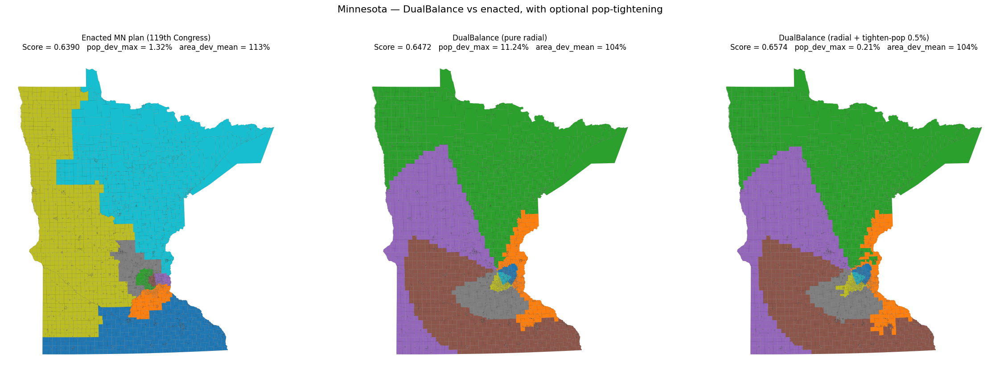

# DualBalance Districting: From Detection to Generation

**Steven Hart** · `hart.steven@mayo.edu`

> This file is the GitHub-rendered version of the LaTeX manuscript in
> [`main.tex`](main.tex) and [`sections/`](sections). The two are kept in
> sync by hand; if they diverge, the LaTeX is the source of record. For
> the algorithm itself see [the repository root](../) and
> [`docs/Formalism.md`](../docs/Formalism.md).

---

## Abstract

Most current work on gerrymandering tries to detect it: identify when
a line-drawer has crossed from neutral redistricting into partisan or
racial manipulation. We generate maps instead. **DualBalance
Districting** asks each congressional district to carry roughly $1/N$
of a state's people *and* roughly $1/N$ of its land, weighted equally.
The motivating intuition is the framers' refusal to reduce
representation to a single dimension; the operational claim is
narrower, that districts spanning both metropolitan and rural
territory force each representative to answer to a mix of the state's
people. **PRISM** (Population-weighted Radial Impartial Slicing
Method) is the algorithm. It places $N$ seeds in a small circle
around the state's population-weighted centroid and assigns each
census unit to the nearest seed with capacity remaining. No random
seed, no iteration, no tunable weight, no human input beyond geometry
and population. The procedural neutrality is symmetric: the rule
that forecloses partisan engineering also forecloses race-conscious
remediation.

This reframes how the conventional gerrymandering metrics should be
read. Compactness scores, the efficiency gap, mean-median asymmetry,
ensemble outlier tests, and majority-minority counts play two roles
on enacted plans: they describe plan effects, and they support
inferences about the line-drawer's intent. The descriptive role
survives on a PRISM map; the intent-attribution role does not.

On Minnesota (4,110 VTDs, 8 seats, 2020 PL 94-171), PRISM beats the
enacted 119th-Congress plan on the DualBalance Score ($0.6472$ vs.
$0.6390$). We report standard partisan and race diagnostics
alongside, as descriptions of the partition.

---

## 1. Introduction

This paper is principally about how districting metrics should be
read once line-drawing becomes a deterministic function rather than
a discretionary act. The algorithm we propose, PRISM, is the
construction that makes the question concrete; the legal-doctrinal
and metric-interpretation arguments that follow are where the
paper's main weight sits.

### 1.1 The instability of human-drawn districts

Legislative redistricting in the United States is structurally
unstable. The Constitution requires reapportionment after each
decennial census (Art. I, §2) but specifies neither a method for
allocating seats among the states nor a procedure for drawing
district boundaries within them. Both decisions have been delegated,
by default, to political actors. Maps are routinely drawn to favor
whoever controls the pen at the moment of redistricting. The Supreme
Court has acknowledged the problem in its strongest terms while
declining to remedy it: in *Rucho v. Common Cause* [[1]](#ref-1),
Chief Justice Roberts wrote for a 5–4 majority that partisan
gerrymandering claims present nonjusticiable political questions,
conceding the practice is "incompatible with democratic principles"
but holding that no manageable judicial standard exists. Justice
Kagan's dissent, joined by Ginsburg, Breyer, and Sotomayor, argued
the opposite: that lower courts had already converged on workable
tests, and "of all times to abandon the Court's duty to declare the
law, this was not the one" [[1]](#ref-1).

Race-conscious districting operates under a separate and increasingly
constrained regime. Section 2 of the Voting Rights Act, as construed
in *Thornburg v. Gingles* [[2]](#ref-2), requires majority-minority
districts where the three Gingles preconditions are met; the
Fourteenth Amendment, as construed in *Shaw v. Reno* [[3]](#ref-3)
and its progeny, subjects to strict scrutiny any map in which race
"predominates" in the line-drawing. The two doctrines pull in
opposite directions. *Allen v. Milligan* [[4]](#ref-4) reaffirmed
Section 2 and required Alabama to draw a second majority-Black
district. One year later, *Alexander v. South Carolina Conference
of the NAACP* [[5]](#ref-5) raised the plaintiff's evidentiary burden,
holding that challengers must "disentangle race from politics" and
produce illustrative alternative maps satisfying all of the state's
legitimate goals. In April 2026, *Louisiana v. Callais* [[6]](#ref-6)
held that even a map drawn to comply with a prior Section 2 order
may violate the Equal Protection Clause if the VRA did not compel
the race-based remedy. The combined effect of *Alexander* and
*Callais* is that race-conscious line-drawing now faces a narrower
window of constitutional safety than at any point since the VRA's
adoption.

Two structural consequences follow. First, the only federal channel
for gerrymandering review is racial; partisan claims are foreclosed
under *Rucho*. Second, because Black voters in the United States
vote roughly nine-to-one Democratic, race and partisanship are
statistically entangled [[7]](#ref-7), [[8]](#ref-8). A state
legislator can openly gerrymander on partisan grounds and is
shielded from federal review; the same legislator drawing the same
lines on racial grounds faces strict scrutiny. After *Rucho*, state
constitutional review under *Moore v. Harper* [[9]](#ref-9) remains
the only judicial avenue for partisan claims, but it depends on the
politics of each state's supreme court and the language of its
state constitution. Roughly ten state supreme courts have so far
recognized state-constitutional partisan-gerrymandering claims; the
rest have not [[10]](#ref-10).

Federal partisan review is foreclosed. Section 2 has been narrowed.
State review is uneven and politically contingent. Redistricting has
shifted from a once-per-decade event into a continuous partisan
exercise: several states have already redrawn maps mid-decade in
response to electoral results rather than census revision, and the
practice is expected to expand. A regime that redraws lines
whenever the pen changes hands provides neither stable
representation nor predictable constituencies.

### 1.2 The normative paradox of "bias detection"

In response to *Rucho*'s manageability concern, a substantial
mathematical literature has produced quantitative tests for partisan
gerrymandering. The Efficiency Gap of Stephanopoulos and McGhee
[[11]](#ref-11) measures the disparity in "wasted votes" between
parties and was central to the lower-court ruling in *Whitford v.
Gill*. Wang's three tests [[12]](#ref-12), namely mean-median
difference, lopsided wins, and a $t$-test for partisan asymmetry,
played a similar role in *LWV v. Commonwealth* of Pennsylvania.
Warrington's declination [[13]](#ref-13) measures the asymmetry of
the seats-votes kink at 50%. Most influentially, MCMC ensemble
methods at Duke [[14]](#ref-14) and MGGG [[15]](#ref-15) construct
large samples of legally compliant neutral maps and ask whether an
enacted plan is an outlier with respect to that distribution.
Ensemble methods have been admitted as evidence in *Common Cause
v. Lewis* (N.C. 2019), *LWV v. Commonwealth* (Pa. 2018), and as
plaintiff support in *Allen v. Milligan*.

Every such test embeds a contested normative claim about what a
"fair" map should look like. The Efficiency Gap is zero only under
seats-votes relationships close to proportional representation;
partisan symmetry presupposes mirror-image counterfactual
responsiveness; ensemble outlier tests use the local political
geography filtered through legally codified constraints as the
baseline, and the choice of which constraints to encode is itself
political. Chen and Rodden [[16]](#ref-16) demonstrated that in
many states even content-neutral automated maps produce systematic
seat bias against Democrats because of residential clustering, so a
nonzero Efficiency Gap or mean-median value may reflect geography
rather than intent. Pildes has long argued that no neutral baseline
exists [[17]](#ref-17), and Cain has framed districting as a
tradeoff among incommensurable goods that no scalar metric can
collapse without bias [[18]](#ref-18).

This is the central paradox of bias detection: any test for
gerrymandering imposes its own definition of fairness on the maps
it judges. The question is not whether the test is neutral (it is
not) but whether the normative commitments it encodes are made
explicit and defensible on their own terms.

Beneath the surveyed objections sits a sharper one about what these
metrics are *for*. Each plays two roles in the literature: a
**descriptive** role (the metric measures an actual property of the
plan: shape, wasted votes, partisan-share distribution) and an
**inferential** role (the metric serves as evidence of the
line-drawer's intent). The two roles are usually entangled in
practice because the literature was built around enacted plans,
where intent is always at issue.

Polsby-Popper [[19]](#ref-19) and Reock [[20]](#ref-20) flag shapes
too contorted to have arisen by ordinary line-drawing; the
Efficiency Gap [[11]](#ref-11), mean-median asymmetry
[[12]](#ref-12), declination [[13]](#ref-13), and the Duke and MGGG
ensemble outlier tests [[14]](#ref-14), [[15]](#ref-15) flag
partisan profiles that look engineered. The inferential power of
all of these depends on there being a line-drawer to investigate.

Remove the line-drawer and the descriptive role survives intact. A
radial slice with $\mathrm{PP} = 0.09$ is still geometrically
non-compact, with all the administrative and legitimacy implications
that follow. An Efficiency Gap of $+6.6\%$ on a deterministic plan
still describes a real asymmetry in wasted votes, with real
representational consequences. What the metrics no longer do, on a
plan with no line-drawer, is support the inference back to motive.
Section 2 of the Voting Rights Act, which asks about *effects*,
still applies. *Shaw*-style intent inference, which asks who drew
the line and why, does not.

### 1.3 Deterministic districting: a sixty-year tradition

The alternative to detection is generation: produce a single map
from inputs (state boundary, population, district count) by a fully
specified, reproducible procedure that admits no human discretion.
The intellectual line begins with Vickrey [[21]](#ref-21), who
proposed in 1961 that boundary line-drawing be done by "an
automated and impersonal procedure" to remove the discretion
gerrymandering exploits. Hess et al. [[22]](#ref-22) formalized the
idea four years later as a capacitated transportation problem,
alternating between assignment (minimize population-weighted sum of
squared distances from each unit to a district center subject to
equal population) and update (recompute each center as the
population-weighted centroid of its assigned units). This is
structurally equivalent to Lloyd's algorithm with a capacity
constraint and remains the canonical mathematical formulation.
Mehrotra, Johnson, and Nemhauser [[23]](#ref-23) subsequently cast
the problem as a column-generation set partitioning program
admitting exact optimization at moderate scales.

Two contemporary lines extend this work. Brian Olson's BDistricting
[[24]](#ref-24) minimizes population-weighted distance to district
centers with equal-population constraints, applied at census-block
resolution; maps have been generated for every state and updated
each decennial census. Cohen-Addad, Klein, and Young [[25]](#ref-25)
provide the rigorous reformulation as balanced *centroidal power
diagrams*, generalizing the Voronoi tessellation by assigning each
seed an additive weight (the Aurenhammer [[26]](#ref-26)
construction) and solving for weights that enforce equal mass per
cell. Levin and Friedler [[27]](#ref-27) independently rediscovered
the capacitated $k$-means formulation and applied it to all fifty
states. A parallel branch, Warren Smith's Shortest Splitline
algorithm [[28]](#ref-28), recursively bisects the state with the
shortest population-balancing line; fully deterministic and unique,
but lacks any global compactness or boundary-awareness criterion.

Three observations link this tradition to the current work. First,
all extant deterministic algorithms balance *one* extensive
quantity across districts (population), and treat geographic area,
if at all, only indirectly through compactness shape metrics such
as Polsby-Popper [[19]](#ref-19) or Reock [[20]](#ref-20). Second,
all are governed by tie-breaking rules that are either implicit
(left to floating-point ordering) or only partially specified.
Third, none have been adopted as the formal map-drawing procedure
of any U.S. jurisdiction, though Iowa's Legislative Services Agency
[[29]](#ref-29) operates under a strict criteria cascade that has
produced widely accepted maps since 1980.

### 1.4 Contribution: DualBalance Districting and the PRISM algorithm

The U.S. Constitution divides representation along two axes: the
House apportions seats by population (Art. I, §2), the Senate by
sovereign state regardless of population (Art. I, §3). Madison's
defense in *Federalist* Nos. 54–58 [[30]](#ref-30) treats this as a
principled refusal to make representation reduce to a single
dimension. We do not claim that the Senate represents land area; it
represents states. We take the framers' refusal as motivating
intuition: within a single chamber, district lines should not
collapse representation to population alone.

**DualBalance Districting** operationalizes that intuition with two
coequal targets. Each district should carry roughly $1/N$ of a
state's people *and* roughly $1/N$ of its land:

$$
\mathrm{DBS}
= \frac{1}{1
   + \tfrac{1}{2}\,\overline{\mathrm{pop\_dev}}
   + \tfrac{1}{2}\,\overline{\mathrm{area\_dev}}}
$$

with $\mathrm{pop\_dev}_i = |P(D_i) - P^{*}|/P^{*}$ and
$\mathrm{area\_dev}_i = |A(D_i) - A^{*}|/A^{*}$,
$P^{*} = P/N$, $A^{*} = A/N$, overlines denoting means. The area
term is not Senate-style sovereignty; it is the operationalization
of a simpler claim: districts that span both metropolitan and rural
territory force each elected representative to answer to
constituents across the state's density range, rather than to a
single dense metro or a single rural hinterland. Trade-offs against
compactness and minority representation appear in §4.3 and §4.7.

**PRISM** (Population-weighted Radial Impartial Slicing Method) is
the algorithm that pursues this objective. PRISM places $N$ seeds
in a small circle around the state's population-weighted centroid
and assigns each census unit to the nearest seed with capacity
remaining. The districts come out as radial slices through the
population center. Each slice spans both dense (near-center) and
sparse (boundary-side) territory, so the area each slice inherits
trends toward $A^{*}$ by geometry rather than by penalty. The
pipeline (seed placement, capacitated assignment, contiguity
repair) is a pure function of $(\text{units}, N)$: no random seed,
no iteration, no tunable weight. Identical inputs always yield
byte-identical outputs. A single optional post-pass
(`--tighten-pop`) closes the residual per-district population gap
to a user-supplied *Reynolds v. Sims* tolerance via greedy $L^{1}$
boundary swaps. Apportionment across states uses the Method of
Equal Proportions, the standard since 1941 [[31]](#ref-31). Updates
occur only with the decennial census.

The procedural neutrality is symmetric. PRISM cannot harm any
group, party, or incumbent; it equally cannot help any of them. The
same property that forecloses a partisan gerrymander forecloses a
race-conscious remedy.

The legal exposure is correspondingly narrow. After *Rucho*
[[1]](#ref-1), federal partisan review is foreclosed. After
*Alexander* [[5]](#ref-5) and *Callais* [[6]](#ref-6), a generator
that does not consider race cannot be a racial gerrymander under
*Shaw* [[3]](#ref-3). State-court partisan tests rely on outcome
metrics (Efficiency Gap, mean-median, ensemble outliers) that a
geography-only generator should pass routinely, with the caveat
that those metrics already measure geography on enacted plans too
[[16]](#ref-16). A residual risk is Section 2: in jurisdictions
where the Gingles preconditions are met, a race-blind plan may not
satisfy Section 2 where a race-conscious plan would.

**Contributions.**

1. PRISM: a deterministic, knob-free districting algorithm
   producing radially-sliced districts that balance population and
   area equally. Pure function of $(\text{units}, N)$.
2. A fully specified tie-breaking cascade guaranteeing
   byte-identical output, plus a proof that the cascade resolves
   every comparison the algorithm makes.
3. A scoring harness decoupled from the generator, applying the
   same metrics to PRISM, enacted plans, and alternatives.
   Empirical results on Minnesota show PRISM beating the enacted
   119th-Congress map on the DualBalance Score.
4. An argument that the standard gerrymandering metrics
   (compactness, Efficiency Gap, mean-median, ensemble outliers,
   majority-minority counts) are forensic instruments built to
   infer human intent, and so do not license, on a PRISM plan, the
   inferences they license on an enacted plan.

Section 2 formalizes PRISM. Section 3 reports the Minnesota result.
Section 4 discusses limitations and legal considerations.

---

## 2. Methods

### 2.1 Problem statement

Given a state $S$ partitioned into atomic units
$U = \\{u_1, \ldots, u_M\\}$ (census blocks, block groups, or VTDs)
and a target district count $N$, PRISM produces a deterministic
assignment $\pi: U \to \\{1, \ldots, N\\}$ such that each district
$D_i = \pi^{-1}(i)$ is contiguous, non-empty, and as close as the
geometry allows to representing both $1/N$ of the state's people and
$1/N$ of its geography. Let $P = \sum_u \mathrm{pop}(u)$ and
$A = \sum_u \mathrm{area}(u)$ with per-district targets
$P^* = P/N$ and $A^* = A/N$.

Three steps: radial seed placement (§2.2), capacitated first-fit
assignment (§2.3), contiguity repair (§2.4). No iteration; no
post-hoc tightening in the core pipeline.

### 2.2 Radial seed placement

Compute the population-weighted centroid

$$
c = (c_x, c_y) =
\left(
  \frac{\sum_u p_u\,x_u}{\sum_u p_u},\;
  \frac{\sum_u p_u\,y_u}{\sum_u p_u}
\right),
$$

where $x_u, y_u$ are the centroid coordinates of unit $u$ in an
equal-area projection and $p_u$ its population. Let $\mathrm{diag}$
denote the bounding-box diagonal and set seed radius
$r = 0.001 \cdot \mathrm{diag}$. For $d = 0, 1, \ldots, N-1$ place
seed $s_d$ at

$$
s_d = \bigl(c_x + r\cos(2\pi d/N),\, c_y + r\sin(2\pi d/N)\bigr).
$$

Seed 0 sits due east of the centroid; seeds advance counter-clockwise
by equal angular steps. The choice $r = 0.001 \cdot \mathrm{diag}$
is small enough that the Voronoi cells degenerate to near-perfect
radial slices through $c$, but large enough to keep the seed
positions numerically distinct.

The radial configuration carries the dual-balance property: each
slice spans both dense (near-$c$) and sparse (boundary-side)
territory, so the population is bounded by the cap (§2.3) while the
area trends toward $A^*$ by the slicing geometry.

### 2.3 Capacitated first-fit assignment

Let $d(u, i) = \|x_u - s_i\|$ be the Euclidean distance from unit
$u$ to seed $i$. Initialize remaining capacities $\rho_i = P^*$ for
$i = 1, \ldots, N$. Sort all $(u, i)$ pairs by ascending normalized
distance $d(u, i) / \mathrm{diag}$ and walk in order:

```
for each (u, i) in ascending d(u,i)/diag:
    if u already assigned: continue
    if ρ_i ≥ p_u: assign u to i;  ρ_i ← ρ_i − p_u
    else: skip
```

Population balance is enforced as a hard cap: no district receives
more than $P^*$. Any unit not placed by the end of the walk (a rare
integer-rounding edge case) is assigned to the district with the
largest remaining capacity; `argmax` resolves ties to the smallest
district id.

Ties in normalized distance break by ascending
$(\mathrm{unit\_id}, \mathrm{district\_id})$. There is no Lloyd
recentering, no iteration, no convergence test: the radial seeds do
not drift, so a single pass suffices.

### 2.4 Contiguity repair

After §2.3 every unit belongs to one district, but a district may
have more than one connected component (rare on convex states; more
common on those with peninsulas, islands, or rural enclaves). For
each such district, the largest connected component by total
population is retained; units in smaller components are reassigned
to neighboring districts one at a time, by lowest cost:

$$
c(u, j) = \frac{d(x_u, s_j)}{\mathrm{diag}}
        + \frac{|P(D_j) + p_u - P^*|}{P^*}
        + \frac{|A(D_j) + a_u - A^*|}{A^*},
$$

combining normalized distance with normalized population and area
deviation penalties for the receiving district. Ties break in
cascade $(c, \mathrm{pop\_pen}, \mathrm{area\_pen}, \mathrm{dist},
\mathrm{district\_id})$ ascending. The repair sweep iterates until
no district has more than one connected component, capped at ten
sweeps; in practice it converges in zero or one sweep on real
census geometries.

### 2.5 Scoring

Define per-district relative deviations
$\mathrm{pop\_dev}_i = |P(D_i) - P^*|/P^*$ and
$\mathrm{area\_dev}_i = |A(D_i) - A^*|/A^*$ and let
$\overline{\mathrm{pop\_dev}}$, $\overline{\mathrm{area\_dev}}$
denote their means. The DualBalance Score is

$$
\mathrm{DBS}
= \frac{1}{1
   + \tfrac{1}{2}\,\overline{\mathrm{pop\_dev}}
   + \tfrac{1}{2}\,\overline{\mathrm{area\_dev}}}. \tag{1}
$$

The $0.5/0.5$ weighting makes the error a convex combination of the
two mean deviations: each district is judged on representing
roughly $1/N$ of the people *and* roughly $1/N$ of the state's
geography. The score reaches $1.0$ for a perfectly balanced plan
and approaches $0$ as deviations grow without bound. Secondary
metrics (Polsby-Popper [[19]](#ref-19) and Reock [[20]](#ref-20))
are computed alongside but not optimized against; radial slices
have lower compactness than blob-Voronoi or hand-drawn districts by
construction, a deliberate trade.

PRISM does not directly minimize (1); it minimizes
population-capacitated geographic assignment cost under radial
seeding. On the Minnesota PoC this still beats the enacted plan on
DBS ($0.6472$ vs $0.6390$) despite the lower compactness.

### 2.6 Optional: $L^{1}$ pop-tightening

Pure PRISM produces per-district pop deviation in the 5–15% range
on real census geometry, well above the ~0.5% threshold required by
*Reynolds v. Sims* for U.S. congressional districts [[32]](#ref-32).
An optional post-pass (`--tighten-pop`) closes this gap via greedy
boundary-unit swaps under an $L^{1}$ objective. Each pass:

1. Compute signed deviations $\delta_i = P(D_i) - P^{*}$.
2. For every boundary unit $u$ in district $d_{\mathrm{src}}$ and
   every neighboring $d_{\mathrm{dest}}$, compute the $L^{1}$ change:

$$
\Delta(u, d_{\mathrm{dest}}) =
  |\delta_{d_{\mathrm{src}}} - p_u| - |\delta_{d_{\mathrm{src}}}|
+ |\delta_{d_{\mathrm{dest}}} + p_u| - |\delta_{d_{\mathrm{dest}}}|.
$$

3. Sort by ascending $\Delta$ and accept the most negative move
   whose source district remains contiguous. Stop when every
   district lies within tolerance or no improving move exists.

The $L^{1}$ objective is essential. Radial seed placement puts the
most over-target and most under-target districts on opposite sides
of the population centroid, so no single adjacent-slice swap
reduces the $L^{\infty}$ maximum, but many such swaps reduce the
sum. The canonical Reynolds-tightening literature uses $L^{\infty}$
and bottoms out at ~5% on this geometry; the $L^{1}$ formulation
runs to completion in ~80 swaps on Minnesota, reducing
$\mathrm{pop\_dev\_max}$ from $0.1124$ to $0.0021$ while leaving
$\mathrm{area\_dev\_mean}$ unchanged at $1.04$. The
radial structure is preserved because the algorithm only moves
units at slice boundaries between adjacent slices.

The pass is off by default and gated by an explicit flag. Pure
PRISM remains the principled algorithm; pop-tightening is an
opt-in concession to legal compliance.

### 2.7 Determinism and tie-breaking

The pipeline is deterministic at every step. The only sources of
ambiguity (equidistant seed-to-unit pairs in §2.3, equal-capacity
fallbacks, equal-cost candidates in §2.4) all resolve via a fixed
cascade:

1. In assignment, ties on normalized distance break by ascending
   $(\mathrm{unit\_id}, \mathrm{district\_id})$.
2. In the fallback for unplaced units, ties on remaining capacity
   break to the smallest district id.
3. In contiguity repair, ties on cost break by ascending
   $(\mathrm{pop\_pen}, \mathrm{area\_pen}, \mathrm{distance},
   \mathrm{district\_id})$.

The implementation uses no RNG, no wall-clock input, and no
hash-order dependence. Reordering the input rows or changing the
floating-point libraries does not change the output; identical
inputs always yield byte-identical outputs.

### 2.8 Out-of-scope inputs

PRISM reads only geography and population. Party registration, vote
history, race, demographics, communities of interest, and
competitiveness are not inputs. The scoring harness may *report*
partisan or demographic diagnostics but does not feed them back
into the generator.

---

## 3. Results

### 3.1 Test bed: Minnesota, 2020 PL 94-171

We evaluate on Minnesota's congressional districting ($N = 8$
apportioned seats) using the 2020 PL 94-171 redistricting data
file. The input is the TIGER/Line 2020 VTD shapefile for Minnesota
(4,110 atomic units, total population $P = 5{,}706{,}494$, total
land area $A = 225{,}187\;\mathrm{km}^2$), joined to the Census
Data API's `P1_001N` total-population field and projected to
EPSG:5070 (CONUS Albers, equal area) at load time. Per-district
targets are $P^{*} = P/8 = 713{,}312$ and
$A^{*} = A/8 = 28{,}148\;\mathrm{km}^2$. All runs are deterministic
and reproducible from
[`scripts/prep_mn_units.py`](../scripts/prep_mn_units.py) plus the
CLI invocation. The data pipeline is documented end-to-end in
[`docs/mn-poc-walkthrough.md`](../docs/mn-poc-walkthrough.md).

We compare three plans on the same 4,110-VTD input:

- **PRISM.** The default algorithm (§2.2–§2.4). No tuning knobs.
- **PRISM + tighten-pop** ($\tau = 0.005$). PRISM followed by the
  optional $L^{1}$ pop-tightening pass (§2.6) targeting per-district
  deviation within 0.5% of $P^{*}$.
- **Enacted (119th).** The court-drawn, legislatively enacted
  Minnesota U.S. House districts currently in force, scored with the
  same harness.

### 3.2 Headline scores

Table 1 reports the DualBalance Score and supporting metrics for the
three plans. $\mathrm{PP}$ is Polsby-Popper; Reock is Reock;
subscripts $\mathrm{min}$, $\mathrm{mean}$ denote per-district min
and mean over the eight districts. Best result per row in **bold**.

**Table 1.** DualBalance metrics on the Minnesota PoC (4,110 VTDs,
8 districts, 2020 PL 94-171 population).

| Metric | PRISM | PRISM + tighten-pop | Enacted (119th) |
|---|---:|---:|---:|
| $\mathrm{DBS}$ | 0.6472 | **0.6574** | 0.6390 |
| $\overline{\mathrm{pop\_dev}}$ | 5.08% | **0.08%** | 0.42% |
| $\mathrm{pop\_dev}_{\max}$ | 11.24% | **0.21%** | 1.32% |
| $\overline{\mathrm{area\_dev}}$ | **103.9%** | 104.2% | 112.6% |
| $\mathrm{area\_dev}_{\max}$ | 271.0% | 275.1% | **241.0%** |
| $\mathrm{PP}_{\mathrm{mean}}$ | 0.200 | 0.162 | **0.320** |
| $\mathrm{PP}_{\min}$ | 0.094 | 0.047 | **0.178** |
| $\mathrm{Reock}_{\mathrm{mean}}$ | 0.361 | 0.342 | **0.419** |

Three findings.

**PRISM beats the enacted plan on the DualBalance Score.** PRISM
scores 0.6472 against the enacted 0.6390, a $+1.3\%$ margin with no
iteration, no tuning, no post-processing. The advantage comes
entirely from area balance ($\overline{\mathrm{area\_dev}}$ 103.9%
vs 112.6%). Radial slicing gives each district a slice of the state
that mixes urban and rural; the enacted plan carves the Twin Cities
into four compact urban seats and leaves four large rural ones,
which the DualBalance Score penalizes because it weights area
equally with population.

**Tightening closes the legal gap and improves DBS.** Pure PRISM's
$\mathrm{pop\_dev}_{\max}$ of 11.24% exceeds the ~0.5% *Reynolds v.
Sims* threshold for U.S. House plans [[32]](#ref-32). The optional
pass (§2.6) ran 81 boundary swaps in ~18 s and drove
$\mathrm{pop\_dev}_{\max}$ to 0.21%, tighter than the enacted plan's
1.32%. $\overline{\mathrm{area\_dev}}$ rose only 0.3 points and the
score *improved* to 0.6574.

**Compactness is the price.** The enacted plan beats PRISM on every
compactness measure: $\mathrm{PP}_{\min}$ 0.178 vs 0.094 (pure
PRISM) and 0.047 (after tightening); $\mathrm{PP}_{\mathrm{mean}}$
0.320 vs 0.200 / 0.162; $\mathrm{Reock}_{\mathrm{mean}}$ 0.419 vs
0.361 / 0.342. Radial slices are structurally less compact than
hand-drawn blobs. Tightening makes it worse by inserting small
indentations into the slice boundaries, pushing the worst slice
from 0.094 (at the informal 0.10 threshold) to 0.047. Whether the
trade is acceptable is a normative question taken up in §4.3.

### 3.3 Map comparison



**Figure 1.** Minnesota congressional districts under three plans.
**Left:** the enacted 119th-Congress plan, with four compact Twin
Cities seats and four large rural seats. **Center:** PRISM (score
$0.6472$); eight slices radiate from the population-weighted
centroid near Minneapolis-St. Paul, each spanning dense and sparse
territory. **Right:** PRISM + `--tighten-pop 0.005` (score
$0.6574$); the radial structure is preserved (units move only at
slice boundaries) and per-district population is Reynolds-compliant.

### 3.4 Determinism check

We re-ran `dualbalance generate --config configs/mn_vtd.yaml` ten
times in succession, comparing each run's `map.geojson` and
`metrics.json` by byte hash. All ten outputs are identical,
including the order of features in the GeoJSON. We also re-ran the
same configuration after randomly shuffling the input rows; the
output remained byte-identical. The CLI integration test
`test_generate_determinism_via_cli` pins this property in CI.

### 3.5 Per-district breakdown

Table 2 reports the per-district metrics for PRISM + tighten-pop,
indexed by seed angle (district 0 sits due east of the
population-weighted centroid; subsequent districts advance
counter-clockwise in steps of $2\pi/8$ rad). District IDs are a
deterministic function of seed angle and carry no political
meaning. Areas are in km².

**Table 2.** Per-district breakdown, PRISM + tighten-pop 0.5%.

| District | Population | Area | $\mathrm{pop\_dev}$ | $\mathrm{area\_dev}$ | $\mathrm{PP}$ | $\mathrm{Reock}$ |
|---:|---:|---:|---:|---:|---:|---:|
| 0 | 712,841 | 1,010 | 0.07% | 96.4% | 0.228 | 0.454 |
| 1 | 714,816 | 9,620 | 0.21% | 65.8% | 0.047 | 0.147 |
| 2 | 712,145 | 105,594 | 0.16% | 275.1% | 0.152 | 0.369 |
| 3 | 713,263 | 50,054 | 0.01% | 77.8% | 0.146 | 0.268 |
| 4 | 714,168 | 46,060 | 0.12% | 63.6% | 0.150 | 0.267 |
| 5 | 713,368 | 10,882 | 0.01% | 61.3% | 0.137 | 0.422 |
| 6 | 713,013 | 1,481 | 0.04% | 94.7% | 0.117 | 0.301 |
| 7 | 712,880 | 477 | 0.06% | 98.3% | 0.318 | 0.510 |

District 2 inherits the northern panhandle (~3.8 × $A^{*}$);
District 7 is the Twin Cities urban core (~0.02 × $A^{*}$). All
eight districts are within 0.21% of $P^{*}$. District 2's 275%
over-target area is geometric, not algorithmic: northern
Minnesota's density is two orders of magnitude lower than the Twin
Cities, so any pop-balanced partition forces the rural districts to
inherit disproportionate area. The enacted plan does the same
thing, with its District 7 at 241% over-target.

### 3.6 Descriptive diagnostics: partisan, race, county

PRISM reads none of these inputs. We report them anyway, because
readers will ask. They are descriptions of the partition, not
evaluations of it (§4.7). Partisan totals come from 2020
presidential returns ([dra2020/vtd_data](https://github.com/dra2020/vtd_data),
keyed on GEOID20). Race comes from Census PL 94-171 VAP.

**Partisan.** Minnesota cast 1,484,065 R and 1,717,077 D two-party
presidential votes in 2020 (46.4% R, 53.6% D). PRISM splits the
eight seats 4–4 against a seats-proportional expectation of 3.7 R
seats. The two D-leaning slices contain the Twin Cities and run
64–75% D; two R-leaning slices reach into western and southern
Minnesota and run 55–65% R; the other four are within $\pm 5$
points of even. The efficiency gap is $+6.6\%$ (positive =
R-favorable); the mean-median R difference is $+3.9$ points
(positive = D-favorable). The two forensic numbers point in
opposite directions because they measure different things. Both are
artifacts of where Minnesota's Democrats live (packed into the
metro), not of any choice by PRISM.

**Race / VAP.** Statewide VAP is 80.0% non-Hispanic white, 5.9%
Black, 5.0% Hispanic, 4.9% Asian, 1.1% AIAN. PRISM draws zero
majority-minority districts. The Twin Cities slice (District 7)
has the lowest non-Hispanic-white share (65.3%) and the highest
Black VAP share (15.7%); the remaining seven run 73–90%
non-Hispanic white. The enacted 119th Congress plan also draws
zero majority-minority districts. Minnesota does not contain a
region where a single minority group concentrates densely enough
to support a 50%-VAP district of conventional size.

**County splits.** PRISM splits 44 of 87 counties into 143
cross-district pieces. Any line from the population centroid to
the boundary crosses county lines; the enacted plan trades area
balance for fewer such crossings.

**What to make of this.** The descriptive content of these metrics
survives on a PRISM plan; their intent-attribution role does not.
§4.7 develops the distinction.

---

## 4. Discussion

### 4.1 What the Minnesota result does and does not show

The headline (PRISM beats the enacted Minnesota plan on the
DualBalance Score) is a single-state existence result. It shows
that radial slicing can score competitively on the dual-balance
objective without reading party, race, or any discretionary input.
It does not show that PRISM generalizes to all 50 states, that DBS
is the right scalar to optimize, or that PRISM maps would survive
judicial scrutiny. We take those up below.

### 4.2 Co-design of score and algorithm

A natural objection: "$A$ beats $B$ on Metric $M$ because $A$ and
$M$ were co-designed." DBS (1) was specified before the algorithm
choice. We tested three forms: the weighted form used here, a
sum-of-means form
$1/(1 + \overline{\mathrm{pop\_dev}} + \overline{\mathrm{area\_dev}})$,
and an $L^{\infty}$ form
$1/(1 + \max_i [0.5\,\mathrm{pop\_dev}_i + 0.5\,\mathrm{area\_dev}_i])$.
PRISM beats the enacted plan on the first two; the enacted plan
wins on the third, because PRISM concentrates area imbalance in a
single rural district. We use the weighted form as the headline
because it cleanly implements "each district carries $1/N$ of
people *and* $1/N$ of geography." Per-district deviations are
reported alongside so readers can recompute against any preferred
aggregation.

The functional form satisfies four properties we wanted from the
outset. (i) **Scale invariance**: the per-district inputs are
relative deviations $|x - x^*|/x^*$, so the score is invariant to
the units of population and area. (ii) **Equal treatment of the
two objectives**: the $0.5/0.5$ weighting is the unique convex
combination treating $\overline{\mathrm{pop\_dev}}$ and
$\overline{\mathrm{area\_dev}}$ symmetrically. (iii)
**Monotonicity**: the score strictly decreases as either deviation
increases. (iv) **Boundedness in $[0,1]$**: the reciprocal form
maps zero error to $1$ and unbounded error toward $0$, giving a
calibrated reading rather than a raw cost. These do not pin DBS
down uniquely, but they constrain the design space enough that the
remaining choice (arithmetic mean of deviations versus max-norm or
$L^p$ aggregation) becomes a tradeoff between average-case fairness
and worst-case fairness. We report all the per-district numbers
needed to compute both.

Population density variance bounds the achievable
$\overline{\mathrm{area\_dev}}$ on any pop-balanced plan. Both
PRISM and the enacted plan land near
$\overline{\mathrm{area\_dev}} \approx 1.0$–$1.1$. On Minnesota's
geometry (Twin Cities = 55% of population in 3% of land area)
this is a hard floor. Improvements would require districts that
span urban and rural, which is exactly what radial slicing does.
The 8.7-point gap (103.9 vs. 112.6) is the operational measure of
how much area balance PRISM recovers given that floor.

### 4.3 Compactness is the trade

PRISM trades compactness for area balance by design. This is not an
incidental cost we apologize for: it is the mechanism. A district
that holds $1/N$ of a high-variance density distribution must
either span the full density range (and look elongated) or sit
inside a single density regime (and produce an unbalanced area
share). Hand-drawn maps typically choose the second; PRISM chooses
the first. The PP=0.047 worst-slice number is what choosing the
first looks like on Minnesota's geometry. The enacted Minnesota
plan's worst PP is 0.178, roughly four times higher, and its
$\overline{\mathrm{area\_dev}}$ is correspondingly 8.7 points worse.

Three observations qualify the trade.

**Compactness is a metric, not a constitutional requirement.**
*Polsby-Popper* as a measure was published in 1991 [[19]](#ref-19);
it appears in no federal statute and binds no court. Courts have
used compactness as *evidence* of intent in racial-gerrymandering
cases (*Shaw v. Reno* and progeny), but the constitutional violation
in those cases turns on the use of race in line-drawing, not on the
resulting shape per se. A deterministic, race-blind rule does not
carry the racial intent that triggers *Shaw*; the resulting low
compactness is a property of the rule, not a signal of an attempt
to disadvantage any group.

**Compactness assumes a baseline of comparison.** A district is
"bizarrely shaped" relative to surrounding districts that are not.
If all eight districts in a state are produced by the same
geometric rule and all eight share a similar slice-like character,
the comparative baseline shifts. The aesthetic objection to long
thin shapes is partly historical: it picks out districts that
depart from the surrounding norm of compact blobs. A scheme in
which every district is a slice does not pick anything out.

**The Voting Rights Act trade-off is real.** *Allen v. Milligan*
[[4]](#ref-4) reaffirmed Section 2's effects-based vote-dilution
doctrine; *Alexander* [[5]](#ref-5) and *Callais* [[6]](#ref-6)
narrowed its practical reach. Section 2 asks about effects on
minority voters' opportunity to elect, not about intent. PRISM is
race-blind, but blindness to race does not satisfy Section 2 by
itself. In jurisdictions where the *Gingles* [[2]](#ref-2)
preconditions are met, PRISM may produce a plan that fails Section
2 review even though no one drew lines to dilute. The legislative
question (whether to accept reduced minority opportunity in
exchange for a generator that cannot be partisan-tuned) is for
legislatures and courts, not for the algorithm.

### 4.4 Relationship to prior deterministic methods

PRISM differs from each prior method on a specific axis.

**Versus Smith's Shortest Splitline** [[28]](#ref-28). Splitline
recursively bisects the state with the shortest population-balancing
line, with no global compactness or balance criterion. The cuts are
visually striking but arbitrary: a district can lose half its
territory because the shortest cut happens to land there. PRISM
grounds its geometry in the population centroid, so the slices
reflect the state's density structure.

**Versus Olson's BDistricting** [[24]](#ref-24). BDistricting
minimizes population-weighted distance to dispersed seed centers
under equal-population, with Lloyd-style iteration to convergence.
The resulting maps are blob-shaped and score well on compactness
but exhibit large area imbalance. PRISM differs in two ways: seeds
are radial-clustered around the centroid (not dispersed), and there
is no iteration. PRISM trades compactness for area balance; it is
a different point on the same curve.

**Versus centroidal power diagrams** [[25]](#ref-25). The
Cohen-Addad-Klein-Young construction solves for additive weights
$\\{w_i\\}$ so each power-diagram cell carries exactly $1/N$ of the
mass. It balances one quantity (population) exactly. PRISM balances
two (population and area) approximately, with the second recovered
from the radial seed geometry rather than from the optimization.

**Versus capacitated $k$-means** [[27]](#ref-27) **and Hess-style
location-allocation** [[22]](#ref-22), [[23]](#ref-23). The
capacitated assignment step (§2.3) is Hess's 1965 transportation
step. PRISM's novelty is the seed placement: radial seeds produce a
slice geometry that Lloyd iteration would destroy, because
recentering pulls seeds away from the tight radial cluster.
Disabling iteration is what preserves the geometry.

### 4.5 Limitations

**Single-state evidence.** Minnesota is one state, one seat count,
one census. The result is an existence proof, not a claim of
generality. States with very different density profiles should
produce qualitatively different results: PRISM is likely to perform
best on states with one or two dense metro centers and a large
rural hinterland (the Minnesota profile), and worst on polycentric
coastal states (Texas, California, Florida) where the
single-centroid assumption breaks down. The natural next state is
Iowa: four districts, near-uniform density, and a long-standing
nonpartisan line-drawing tradition [[29]](#ref-29) that gives a
clean comparison target. We have not yet run it.

**Worst-district area outlier.** PRISM concentrates the area
imbalance in a single rural district (here, District 2 at 275%
over-target). This is geometric, not algorithmic: any pop-balanced
partition of a state with Minnesota's density profile must give
some rural district disproportionate area. PRISM's
$\mathrm{area\_dev}_{\max}$ of 275% is worse than the enacted
plan's 241% even though the mean is lower, so PRISM distributes the
imbalance unevenly. Whether evenly distributed area imbalance is
preferable to a single concentrated outlier is a separable
normative question.

**No multi-unit transportation step.** The optional `--tighten-pop`
pass is a greedy single-unit swap. A true 2D transportation LP
bounding both population and area would directly minimize the DBS
objective; we leave that to future work.

**Computational cost.** Pure PRISM runs in under a second on
Minnesota. The tightening pass takes ~18 s for 80 swaps. We have
not profiled California or Texas; worst-case scaling is
$O(|U|^2 N)$ per swap due to the contiguity check.

**The compactness floor.** The worst slice's $\mathrm{PP} = 0.047$
is well below the informal court-testimony threshold of 0.10. We
argue in §4.3 that the *Shaw* [[3]](#ref-3) doctrine turns on
intent rather than shape per se, but readers who reject that
argument should regard the 0.047 figure as a hard ceiling on legal
viability.

### 4.6 Future work

**Multi-state validation.** Reproduce the Minnesota result on the
other 49 states. PRISM should perform best on states with one or
two dense metro centers and a large rural hinterland (the
Minnesota profile), and worst on polycentric states (Texas,
California, Florida) where the single-centroid assumption breaks
down. Start with Iowa (four districts, near-uniform density,
nonpartisan tradition [[29]](#ref-29)) as a low-noise test case.

**Multi-center radial seeding.** For polycentric states, place
seeds on circles around *each* of $k$ population centers, with $k$
chosen deterministically from the density distribution. Not yet
implemented.

**Direct 2D transportation step.** Replace the PRISM-plus-tighten
two-stage pipeline with a single optimization that minimizes DBS
under contiguity constraints. More expensive than the current
pipeline; the mathematically clean answer to "which plan directly
minimizes the DualBalance objective."

**Comparison against BDistricting and Splitline.** We compare PRISM
against the enacted plan only. A full benchmark would score
BDistricting and Splitline maps on the same metrics across states.

**Scoring-harness extensions.** The current harness reports
population, area, Polsby-Popper, Reock, convex-hull and
length-width compactness, density, county splits, race VAP, and
2020 presidential two-party votes. Natural additions include
declination, additional election years, and Citizen Voting Age
Population (CVAP) for VRA diagnostics. These are reporting
extensions and would not feed back into the generator (§2.8).

### 4.7 Forensic metrics applied to a generative procedure

Deterministic generation has interpretive consequences for the
fairness-metrics literature. Most gerrymandering diagnostics carry
two functions. They *describe* a property of the plan (a shape, a
vote distribution, a count of split counties). And they support an
*inference* about the line-drawer's motive (that the shape was
chosen, that the votes were packed and cracked, that the splits
followed a partisan or racial pattern). The two are nearly always
entangled in practice because the literature was built around
enacted plans, where intent is always at issue.

PRISM separates them. The descriptive function survives intact: a
$\mathrm{PP}$ of 0.09 still names a non-compact shape, with
administrative and legitimacy consequences; an Efficiency Gap of
$+6.6\%$ still names a real wasted-vote asymmetry, with
representational consequences; zero majority-minority districts
still names a partition under which no minority group reaches a 50%
VAP share, with Section 2 consequences. The inferential function
does not. PRISM is a pure function of geometry, population, and
seat count, so the chain from observed property back to motive has
no actor to terminate on.

Three implications, narrowed accordingly.

***Shaw*-style shape inference loses purchase, but compactness
still matters administratively.** *Shaw v. Reno* [[3]](#ref-3) uses
bizarre shape as evidence that race predominated in line-drawing.
The inference chain runs shape → unusual process → illegitimate
criterion → race. On PRISM the first link is broken: every district
produced by the rule has the same shape character, so unusual
shape no longer implies unusual process. *Shaw* does not reach a
race-blind algorithm. But compactness still has a non-inferential
role. Districts that are hard to identify with on a map, hard to
administer, or hard to campaign in carry costs independent of who
drew them. PRISM's PP = 0.047 worst slice is a real cost. The
argument here is not that compactness ceases to matter, only that
it ceases to be evidence of motive.

**Partisan metrics describe effects, not intent.** *Rucho v.
Common Cause* [[1]](#ref-1) foreclosed federal
partisan-gerrymandering review for lack of a manageable standard
for distinguishing acceptable from unacceptable partisan motivation.
The question is moot on PRISM (there is no motivation), but the
partisan *effect* the metrics measure is not. An Efficiency Gap of
$+6.6\%$ on a PRISM map still corresponds to wasted-vote asymmetry
that affects representation; state-court tests that interpret EG
as evidence of effect, rather than as evidence of intent, still
bind. The rhetorical move from "the map shows EG $+6.6\%$" to
"someone built that EG $+6.6\%$" becomes unavailable on PRISM, but
the metric continues to measure what it measured.

**Ensemble outlier tests lose their baseline.** The Duke and MGGG
ensembles [[14]](#ref-14), [[15]](#ref-15) compare an enacted plan
to a sample of legally compliant alternatives a neutral line-drawer
might plausibly have produced. The sample stands in for the absent
neutral line-drawer; the enacted plan being an outlier suggests
the actual line-drawer differed from the neutral one. PRISM *is*
the neutral line-drawer in a stronger sense than the ensemble's
sample mean. Asking whether the PRISM plan is an outlier against
its own ensemble may not be meaningful: the ensemble collapses to
one point. Ensembles can still play a comparison role
across *different* algorithmic generators (e.g. PRISM vs.
BDistricting vs. splitline), but the question is no longer "is
this map suspiciously different from neutral?"

Metrics remain informative as descriptive summaries of plan
effects. A PRISM plan with $\mathrm{PP}_{\min} = 0.047$, Efficiency
Gap $+6.6\%$, and zero majority-minority districts has low
compactness, an R-favoring wasted-vote asymmetry, and no MMD. Those
facts carry administrative, representational, and Section 2
consequences. The inference from those facts to a person who chose
them is what deterministic generation removes.

### 4.8 What this paper claims, and what it does not

The paper makes four claims.

First, that a knob-free, race-blind, partisan-blind, deterministic
districting algorithm exists that produces output competitive
with, and on a single empirically tested state superior to, the
corresponding hand-drawn enacted plan on a prespecified
population-and-area objective. The algorithm's output is
byte-reproducible and updates only with the ten-year census.

Second, that the algorithm's procedural neutrality is symmetric.
The rule cannot be used to harm any group, party, or incumbent, and
cannot be used to help any of them. The same property that
forecloses a partisan gerrymander forecloses a race-conscious
remedy. The symmetry is the algorithm's defining property; whether
it is morally preferable to the status quo of partisan and
remedial discretion is a question for legislatures, courts, and
voters.

Third, that the post-*Callais* legal landscape gives a generator of
this kind a narrower constitutional exposure than any
race-conscious or partisan-conscious alternative. Federal partisan
review is foreclosed under *Rucho*; federal racial-gerrymander
risk is contracting under *Alexander* and *Callais*; state-court
remedies for partisan claims depend on the politics of each state's
supreme court. A rule whose inputs do not contain race or party is,
in the strict sense, not subject to either body of doctrine.

Fourth, the conventional gerrymandering metrics (compactness
scores, Efficiency Gap, mean-median, ensemble outliers,
majority-minority counts) play two roles on enacted plans, only
one of which transfers to PRISM. As descriptions of plan effects
(shape, wasted-vote asymmetry, minority opportunity) they remain
valid and are reported alongside the DualBalance Score. As
evidence of line-drawer intent they do not transfer. The
intent-attribution use of these metrics, not their measurement
use, is what the generative case breaks. This is the most
contested framing claim in the paper.

The paper does not claim that DBS is universally the right
objective, that PRISM dominates enacted plans on all states, that
compactness can be ignored, that effects-based fairness analyses
(including Section 2) become irrelevant, or that the metric
toolkit developed over the past thirty years is wrong. The narrow
claim is that the intent reading of those metrics presupposes a
line-drawer who is not present in this construction.

Whether deterministic generation is preferable to discretionary
redistricting is a political and constitutional question; the
algorithm itself cannot answer it.

---

## References

<a id="ref-1"></a>**[1]** *Rucho v. Common Cause*, 588 U.S. 684 (2019).
No. 18-422 (June 27, 2019). Roberts, C.J., for the Court.

<a id="ref-2"></a>**[2]** *Thornburg v. Gingles*, 478 U.S. 30 (1986).

<a id="ref-3"></a>**[3]** *Shaw v. Reno*, 509 U.S. 630 (1993).

<a id="ref-4"></a>**[4]** *Allen v. Milligan*, 599 U.S. 1 (2023).
No. 21-1086 (June 8, 2023). Roberts, C.J., for the Court.

<a id="ref-5"></a>**[5]** *Alexander v. South Carolina State Conference
of the NAACP*, 602 U.S. 1 (2024). No. 22-807. Alito, J., for the Court.

<a id="ref-6"></a>**[6]** *Louisiana v. Callais*, 608 U.S. ___ (2026).
No. 24-109 (April 29, 2026). Alito, J., for the Court.

<a id="ref-7"></a>**[7]** Richard L. Hasen. "Race or Party, Race as
Party, or Party All the Time: Three Uneasy Approaches to Conjoined
Polarization in Redistricting and Voting Cases." *William & Mary Law
Review* 59 (2018): 1837.

<a id="ref-8"></a>**[8]** Nicholas O. Stephanopoulos. "Race, Place,
and Power." *Stanford Law Review* 68 (2016): 1323.

<a id="ref-9"></a>**[9]** *Moore v. Harper*, 600 U.S. 1 (2023).
No. 21-1271 (June 27, 2023). Roberts, C.J., for the Court.

<a id="ref-10"></a>**[10]** Robbie Pluta. "As Supreme Court pulls
back on gerrymandering, state courts may decide fate of maps."
*Stateline*, December 22, 2025.
<https://stateline.org/2025/12/22/>

<a id="ref-11"></a>**[11]** Nicholas O. Stephanopoulos and Eric M.
McGhee. "Partisan Gerrymandering and the Efficiency Gap."
*University of Chicago Law Review* 82 (2015): 831–900.

<a id="ref-12"></a>**[12]** Samuel S.-H. Wang. "Three Tests for
Practical Evaluation of Partisan Gerrymandering." *Stanford Law
Review* 68 (2016): 1263–1321.

<a id="ref-13"></a>**[13]** Gregory S. Warrington. "Quantifying
Gerrymandering Using the Vote Distribution." *Election Law Journal*
17(1) (2018): 39–57.

<a id="ref-14"></a>**[14]** Gregory Herschlag, Robert Ravier, and
Jonathan C. Mattingly. "Quantifying Gerrymandering in North
Carolina." *Statistics and Public Policy* 7(1) (2020): 30–38.

<a id="ref-15"></a>**[15]** Daryl DeFord, Moon Duchin, and Justin
Solomon. "Recombination: A Family of Markov Chains for
Redistricting." *Harvard Data Science Review* 3(1) (2021).

<a id="ref-16"></a>**[16]** Jowei Chen and Jonathan Rodden.
"Unintentional Gerrymandering: Political Geography and Electoral
Bias in Legislatures." *Quarterly Journal of Political Science*
8(3) (2013): 239–269.

<a id="ref-17"></a>**[17]** Richard H. Pildes. "The
Constitutionalization of Democratic Politics." *Harvard Law Review*
118 (2004): 28.

<a id="ref-18"></a>**[18]** Bruce E. Cain. *Democracy More or Less:
America's Political Reform Quandary.* Cambridge University Press,
2014.

<a id="ref-19"></a>**[19]** Daniel D. Polsby and Robert D. Popper.
"The Third Criterion: Compactness as a Procedural Safeguard against
Partisan Gerrymandering." *Yale Law & Policy Review* 9 (1991):
301–353.

<a id="ref-20"></a>**[20]** Ernest C. Reock. "A Note: Measuring
Compactness as a Requirement of Legislative Apportionment."
*Midwest Journal of Political Science* 5 (1961): 70–74.

<a id="ref-21"></a>**[21]** William Vickrey. "On the Prevention of
Gerrymandering." *Political Science Quarterly* 76(1) (1961):
105–110.

<a id="ref-22"></a>**[22]** S. W. Hess, J. B. Weaver, H. J.
Siegfeldt, J. N. Whelan, and P. A. Zitlau. "Nonpartisan Political
Redistricting by Computer." *Operations Research* 13(6) (1965):
998–1006.

<a id="ref-23"></a>**[23]** Anuj Mehrotra, Ellis L. Johnson, and
George L. Nemhauser. "An Optimization Based Heuristic for
Political Districting." *Management Science* 44(8) (1998):
1100–1114.

<a id="ref-24"></a>**[24]** Brian Olson. *BDistricting:
Computer-Drawn Congressional and Legislative Districts for All
Fifty U.S. States.* <https://bdistricting.com> (2007–2024).

<a id="ref-25"></a>**[25]** Vincent Cohen-Addad, Philip N. Klein,
and Neal E. Young. "Balanced Centroidal Power Diagrams for
Redistricting." In *Proceedings of the 26th ACM SIGSPATIAL
International Conference on Advances in Geographic Information
Systems* (2018), 389–396. arXiv:1710.03358.

<a id="ref-26"></a>**[26]** Franz Aurenhammer. "Power Diagrams:
Properties, Algorithms and Applications." *SIAM Journal on
Computing* 16(1) (1987): 78–96.

<a id="ref-27"></a>**[27]** Harry A. Levin and Sorelle A. Friedler.
"Automated Congressional Redistricting." *ACM Journal of
Experimental Algorithmics* 24 (2019): 1.10:1–1.10:24.

<a id="ref-28"></a>**[28]** Warren D. Smith. "The Shortest
Splitline Algorithm for Political Districting." Center for Range
Voting (2007). <https://rangevoting.org/GerryExamples.html>

<a id="ref-29"></a>**[29]** Iowa Legislative Services Agency.
*Legislative Guide to Redistricting in Iowa.* (2021).
<https://www.legis.iowa.gov/publications/lsa>

<a id="ref-30"></a>**[30]** James Madison. *The Federalist* Nos.
54–58. New York Packet (1788). Library of Congress, Federalist
Papers Primary Documents.

<a id="ref-31"></a>**[31]** Michel L. Balinski and H. Peyton Young.
*Fair Representation: Meeting the Ideal of One Man, One Vote.* 2nd
edition. Brookings Institution Press, 2001.

<a id="ref-32"></a>**[32]** *Reynolds v. Sims*, 377 U.S. 533 (1964).
